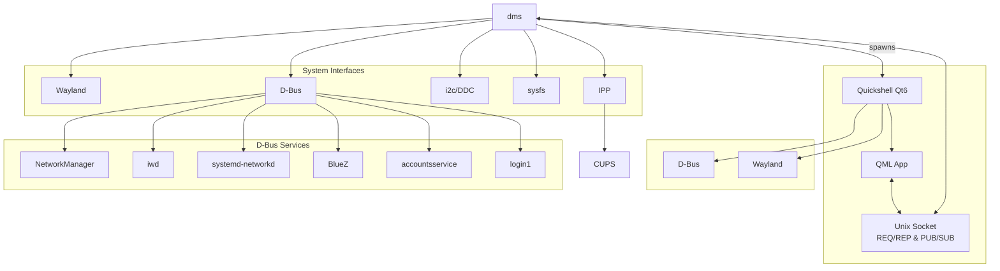

import Hero from '@site/src/components/Hero';

<Hero
  asciiArt={`██████╗ ███╗   ███╗███████╗
██╔══██╗████╗ ████║██╔════╝
██║  ██║██╔████╔██║███████╗
██║  ██║██║╚██╔╝██║╚════██║
██████╔╝██║ ╚═╝ ██║███████║
╚═════╝ ╚═╝     ╚═╝╚══════╝`}
  hideTitle={true}
/>

DankMaterialShell (dms) is a Wayland desktop shell built with [Quickshell](https://quickshell.org/) and [Go](https://go.dev/). It serves a purpose similar to GNOME Shell or KDE Plasma, providing a unified interface for launching applications, managing windows, managing hardware interfaces, notifications, and much more.

## General Features

- Launcher (Apps, file search, web search, emoji search, calculations, and extendable with plugins)
- System Tray
- Notifications with grouping support
- Network Management (via NetworkManager, iwd, systemd-networkd, or some hybrid setups)
- VPN Management (via NetworkManager)
- Bluetooth Management (via BlueZ)
- Audio Management (via PipeWire)
- Idle & Power Management
- Brightness controls (Backlight, LEDs, and i2c/ddc)
- Lock Screen
- Process & System Monitoring
- Theming (Light, Dark, Automatic Colors, Premade themes, and Custom Accent Colors)
- Multi-monitor support
- Gamma control (night mode)
- Wallpaper management with transitions, multi-monitor support, and automatic transitioning.
- Clipboard history manager
- System sounds (such as notifications, volume changes, etc.)
- Mpris media controls with audio visualization
- Dozens of widgets and plugins available to allow virtually any feature you can imagine.

*There's really too much to list, but those are some of the highlights!*

## Architecture

DankMaterialShell uses a client-server architecture where a Go backend (`dms`) manages system integrations and spawns the Quickshell-based UI as a child process. Communication happens over Unix socket using REQ/REP and PUB/SUB patterns.

**Key Points:**

- **dms** spawns **Quickshell** as a child process
- **dms** and **Quickshell** both integrate with Wayland and D-Bus APIs independently
- **dms** fills gaps that Quickshell doesn't handle natively
- Communication between QML app and dms backend happens via Unix socket

### Component Overview

| Component | Role |
| --- | --- |
| **DankMaterialShell - Quickshell** | Frontend powering widgets, modals, and user experience. |
| **DankMaterialShell - Backend (cli)** | Bridges DBus, Wayland, and plugin APIs - also a management CLI |
| **dgop** | Optional system telemetry service used by resource widgets. |
| **dsearch** | Optional filesystem search engine used by the Spotlight launcher. |

## Next Steps

Continue with [Installation](installation) to get DankMaterialShell running on your system.

DankMaterialShell is open source and welcomes contributions ranging from new widgets and plugins to documentation improvements. Dive into the [GitHub repository](https://github.com/AvengeMedia/DankMaterialShell) to get involved.
